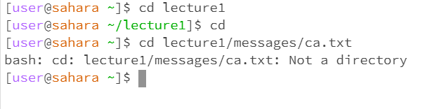
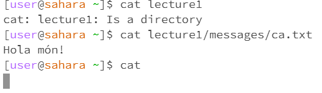

# **Lab Report 1**
---
## cd Commands

 
*cd without any arguments*
1. The working directory was the directory lecture1.
2. When cd is called on its own, it will backtrack to the directory that is as far back as possible. For us, that is user@sahara.
3. There isn't an error as it does go back and send us to the top as it is supposed to.

*with directory as its argument*
1. The working directory was the main desktop in edstem that is being used for the lab called user@sahara.
2. When cd is called with a directory as its argument, it will jump into it and set it as the new directory that we are operating inside of. Due to this, when we call cd lecture1, it jumps into the lecture1 directory.
3. There is no error as the command is completed perfectly and does what we expect it to do.

*with a file path as an argument*
1. The working directory was the main desktop in edstem that is being used for the lab called user@sahara.
2. When cd is called trying to jump into a specific file, it gets confused as it is a command used solely for getting into directories and therefore returns the statement saying it is not a directory.
3. yes, this is an error as cd is a command used solely for the purpose of entering directories and throws the error as it cannot enter files.

   

## ls Commands

 
*ls without any arguments*
1. The working directory was the main desktop in edstem that is being used for the lab called user@sahara.
2. When ls is called, it lists all the directories on the desktop which for us would be lecture1 so it prints out lecture 1.
3. There is not an error as there is only one directory present and it prints that specific one.

*with directory as its argument*
1. The working directory was the main desktop in edstem that is being used for the lab called user@sahara.
2. When ls is called on a directory, the expectation is that our command line will print out all the contents in the directory. In our case, the computer prints out all the contents of lecture1.
3. There is no error as the command is completed perfectly and does what we expect it to do.

*with a file path as an argument*
1. The working directory was the main desktop in edstem that is being used for the lab called user@sahara.
2. When ls is called with a file path to a specific file, it just prints out that file path that we typed into the path. It is doing so as it is listing all the directories that we have gone through to reach the specific file.
3. No there is not an error as it does list out all the directories being accessed and also allows us to constantly write more commands to the command line.
## cat Commands

 
*cat without arguments*
1. The working directory was the main desktop in edstem that was being used in the lab called user@sahara.
2. When cat was called without any arguments, the terminal waits for the user to type in some input on the next line. Once something is typed in, the termina just returns that same string back.
3. There is not an error as the terminal takes in user input and then returns it back to the user.

*with directory as its argument*
1. The working directory was the main desktop in edstem that is being used for the lab called user@sahara.
2. When cat is called with a directory, it cannot read the data from a directory and print it. Therefore, when we call cat lecture1, we get the output telling us that it is a directory without actually reading any of the files inside the directory.
3. There is an error here as cat cannot actually read what is contained inside of the directory and is telling us why it cannot read what is inside.

*with a file path as an argument*
1. The working directory was the main desktop in edstem that is being used for the lab called user@sahara.
2. When we call cat on a certain file, the command will now read out its contents. in our case, the command reads and prints out the text included in ca.txt and prints out the string.
3. No there is not an error as it prints out the contents within ca.txt and reads the data being stored correctly.
