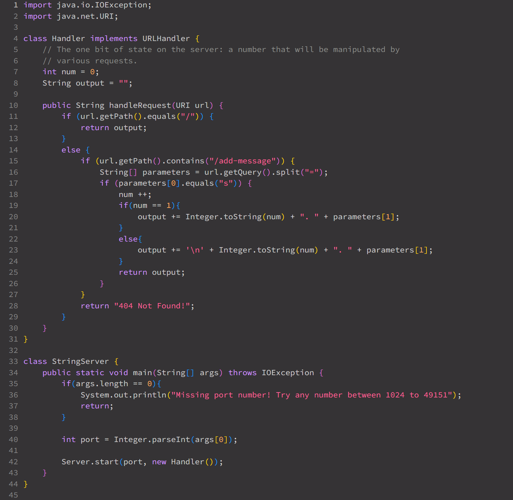
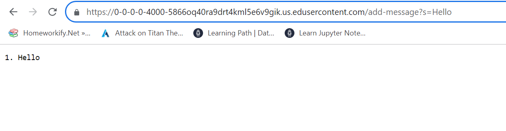
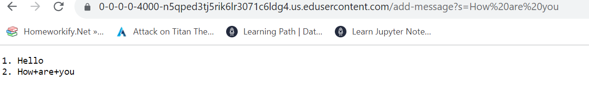
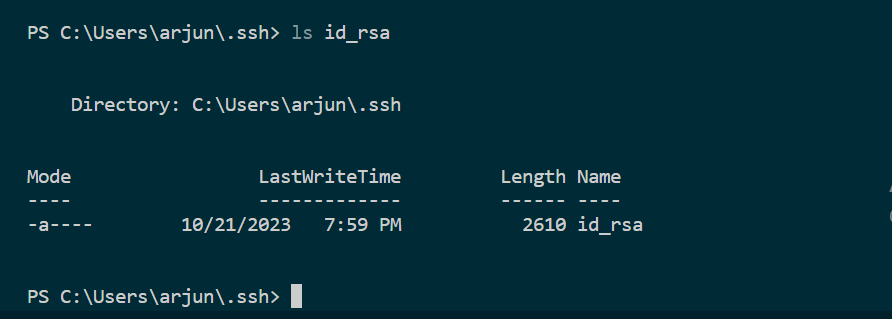
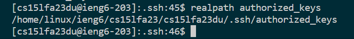
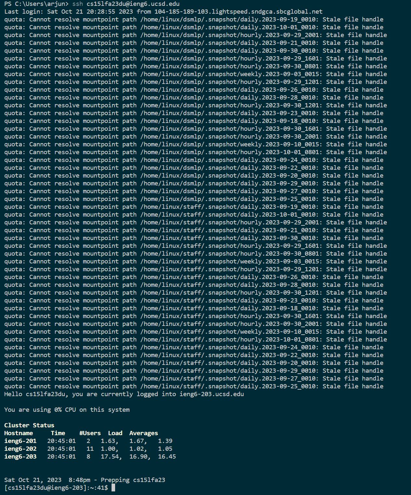

# **Lab Report 2**
---
## Part 1 
*Code of StringServer.java*

 
 
*Output after using /add-message?s=Hello*

 
1. In our code, the function being called currently is handleRequest(URI url).
2. For handleRequest, it requires the URL of the local server we are working on. Inside handleRequest, we have two fields called num and output. Num stores the amount of messages being added to our server. Output contains the actual characters to display the messages in the correct number order.
3. In this current call of handleRequest, both num and output are changed. Num changes as we finally have a message to show so num goes from 0 to 1. Output is initially putting the number stored in num to create a number list. It then adds the string provided by the query and outputs it.
 
 

*Output after using /add-message?s=How are you*

1. In our code, the function being called currently is handleRequest(URI url).
2. For handleRequest, it requires the URL of the local server we are working on. Inside handleRequest, we have two fields called num and output. Num stores the amount of messages being added to our server. Output contains the actual characters to display the messages in the correct number order.
3. In this current call of handleRequest, both num and output are changed. Num changes as we finally have a message to show so num goes from 1 to 2. Output is initially sent a new line character to shift the next message down a line. It then writes the number stored in num to create a number list. It then adds the string provided by the query and outputs it.
 
 

## Part 2
*Path of Private Key*

*Path of Public Key*

*Log in without asking for a password*

## Part 3
I did not know that we could run local hosts just through Java. I had never done something like this before and was caught by surprise by how simple it really is. I also did not know that we would be using RSA to have our login credentials saved to different devices. RSA is something I learned about last year but I had never seen it actually used in practice till now which was very interesting.
