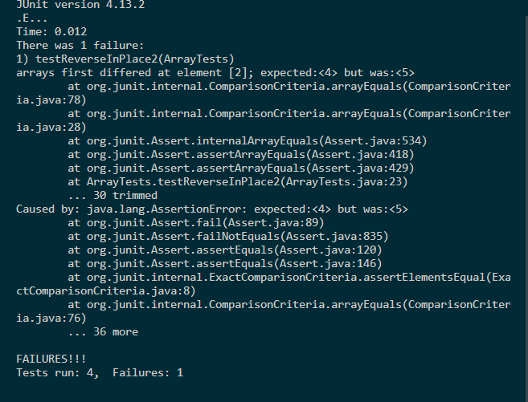

# **Lab Report 3**
---
## Part 1 - Bugs
*Faulty Test*
```
 @Test
  public void testReverseInPlace2(){
    int[] input1 = { 3, 4, 5, 6};
    ArrayExamples.reverseInPlace(input1);
    assertArrayEquals(new int[]{6, 5, 4 , 3}, input1);
  }
```

*Passing Test*
```
@Test 
	public void testReverseInPlace() {
    int[] input1 = { 3 };
    ArrayExamples.reverseInPlace(input1);
    assertArrayEquals(new int[]{ 3 }, input1);
	}
```

*Output of both tests*



