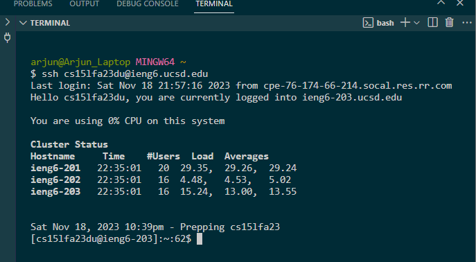
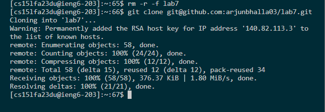
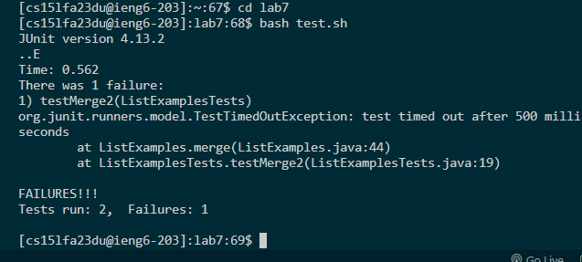
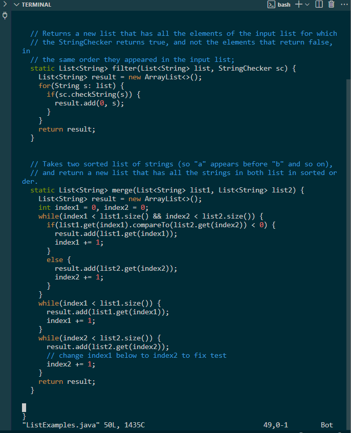
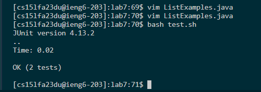
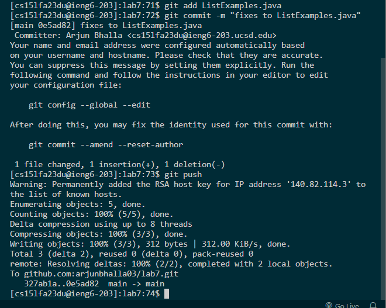

# **Lab Report 4**
---
## Step 4 - Log into ieng6



```
ssh cs15lfa23du@ieng6.ucsd.edu <enter>
```
Sign into ssh


## Step 5 - Cloning into ssh


```
rm -r -f lab7 <enter>
```
Delete the previously saved repository

```
git clone git@github.com:arjunbhalla03/lab7.git
```
Clone the repository

## Step 6 - Run the Tests



```
cd lab7 <enter>
```

make the working directory lab7

```
bash test.sh <enter>
```
Run the JUnit tests scripts inside test.sh


## Step 7 - Use Vim and make changes



```
vim ListExamples.java <enter>
```
Enter the file to edit it

```
<up> <up> <up> <up> <up> <right> <right> <right> <right> <right> <right> <right> <right> <right> 
```
Put the cursor into the correct position to make the change.

```
"i"
```
Enter insert mode to make the change

```
<backspace>
"2"
```
Changes the field from index1 to index2.

```
<esc>
:wq! <enter>
```
Exit and save the changes made to the file.

## Step 8 - Re-run Tests


```
bash test.sh
```
Re-running the tests to prove that the code has been edited correctly.

## Step 9 - Commiting and Pushing to Github



```
git add ListExamples.java <enter>
git commit -m "fixes to ListExamples.java" <enter>
git push <enter>
```
Completing the three required stages of making a push to a Github repository. Add ListExamples.java to the git stage. Commit the changes to be official and also be ready to be sent to the remote repository. Finally, we push these changes to the remote repository making sure that we have officially made these changes in GitHub.
