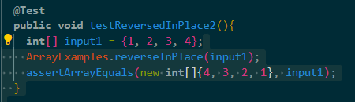
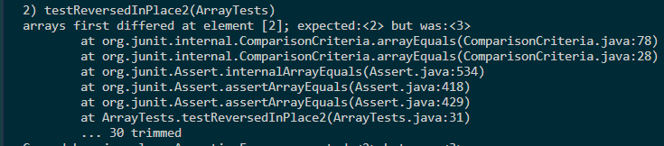

# **Lab Report 5**
---
## Part 1 - Debugging Scenario
Student Message:
Hi there! I was working on Lab 3 and I ran into an error when working on ArrayExamples.java. This was the test I ran:

This was the output I received: 

I think that there may be something wrong with my actual loop and the switching but I am not too sure. Any help would be great.

TA Response:
You should look at what values are being switched. As this function reuqires you to make the swap within the array, make sure that the swap is happening correctly.

## Part 2 - Reflection

In the second half of the quarter, the thing I would say I appreciated learning the most was learning how to use jdb. Using jdb makes seeing what my program is actually doing step by step. There is only so many test cases you can think of so I think just being able to see what is actually happening is very beneficial. The ability to also see what the exact values of the loal fields in our code is extremely useful and is something I will most defintely be using in the future.
